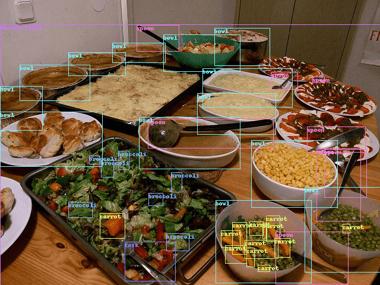

# PyTorch Custom Dataset

## Preparation

- [COCO128](https://www.kaggle.com/ultralytics/coco128), YOLOv5 dataset structure

```bash
$ tree ~/datasets/coco128 -L 2
/home/john/datasets/coco128
├── images
│   └── train2017
│       ├── ...
│       └── 000000000650.jpg
├── labels
│   └── train2017
│       ├── ...
│       └── 000000000650.txt
├── LICENSE
└── README.txt
```

- [Train Custom Data - YOLOv5](https://github.com/ultralytics/yolov5/wiki/Train-Custom-Data)

## Define Dataset

`torch.utils.data.Dataset` is an abstract class representing a
dataset.

- [torch.utils.data.Dataset](https://pytorch.org/docs/stable/data.html#torch.utils.data.Dataset)
- [torchvision.datasets.vision.VisionDataset](https://github.com/pytorch/vision/blob/master/torchvision/datasets/vision.py)

Your custom dataset should inherit `Dataset` and override the following
methods:

- `__len__` so that `len(dataset)` returns the size of the dataset.
- `__getitem__` to support the indexing such that `dataset[i]` can
   be used to get `i` th sample.

```python
import os
from pathlib import Path
from typing import Any, Callable, Optional, Tuple

import numpy as np
import torch
import torchvision
from PIL import Image


class YOLOv5(torchvision.datasets.vision.VisionDataset):

  def __init__(
    self,
    root: str,
    name: str,
    transform: Optional[Callable] = None,
    target_transform: Optional[Callable] = None,
    transforms: Optional[Callable] = None,
  ) -> None:
    super(YOLOv5, self).__init__(root, transforms, transform, target_transform)
    images_dir = Path(root) / 'images' / name
    labels_dir = Path(root) / 'labels' / name
    self.images = [n for n in images_dir.iterdir()]
    self.labels = []
    for image in self.images:
      base, _ = os.path.splitext(os.path.basename(image))
      label = labels_dir / f'{base}.txt'
      self.labels.append(label if label.exists() else None)

  def __getitem__(self, idx: int) -> Tuple[Any, Any]:
    img = Image.open(self.images[idx]).convert('RGB')

    label_file = self.labels[idx]
    if label_file is not None:  # found
      with open(label_file, 'r') as f:
        labels = [x.split() for x in f.read().strip().splitlines()]
        labels = np.array(labels, dtype=np.float32)
    else:  # missing
      labels = np.zeros((0, 5), dtype=np.float32)

    boxes = []
    classes = []
    for label in labels:
      x, y, w, h = label[1:]
      boxes.append([
        (x - w/2) * img.width,
        (y - h/2) * img.height,
        (x + w/2) * img.width,
        (y + h/2) * img.height])
      classes.append(label[0])

    target = {}
    target["boxes"] = torch.as_tensor(boxes, dtype=torch.float32)
    target["labels"] = torch.as_tensor(classes, dtype=torch.int64)

    if self.transforms is not None:
      img, target = self.transforms(img, target)

    return img, target

  def __len__(self) -> int:
    return len(self.images)
```

The dataset `__getitem__` will return:

- image: a PIL Image of size (H, W)
- target: a dict containing the following fields
  - `boxes` (`FloatTensor[N, 4]`): the ground-truth boxes in `[x1, y1, x2, y2]` format, with values of `x` between `0` and `W` and values of `y` between `0` and `H`
  - `labels` (`Int64Tensor[N]`): the class label for each ground-truth box

## Read Dataset

```python
dataset = YOLOv5(Path.home() / 'datasets/coco128', 'train2017')
print(f'dataset: {len(dataset)}')
print(f'dataset[0]: {dataset[0]}')
```

Output:

```bash
dataset: 128
dataset[0]: (<PIL.Image.Image image mode=RGB size=640x480 at 0x7F6F9464ADF0>, {'boxes': tensor([[249.7296, 200.5402, 460.5399, 249.1901],
        [448.1702, 363.7198, 471.1501, 406.2300],
        ...
        [  0.0000, 188.8901, 172.6400, 280.9003]]), 'labels': tensor([44, 51, 51, 51, 51, 44, 44, 44, 44, 44, 45, 45, 45, 45, 45, 45, 45, 45,
        45, 50, 50, 50, 51, 51, 60, 42, 44, 45, 45, 45, 50, 51, 51, 51, 51, 51,
        51, 44, 50, 50, 50, 45])})
```

Preview:



## Use DataLoader

```python
dataset = YOLOv5(Path.home() / 'datasets/coco128', 'train2017',
  transform=torchvision.transforms.Compose([
    torchvision.transforms.ToTensor()
  ]))

dataloader = DataLoader(dataset, batch_size=64, shuffle=False,
                        collate_fn=lambda batch: tuple(zip(*batch)))

for batch_i, (images, targets) in enumerate(dataloader):
  print(f'batch {batch_i}, images {len(images)}, targets {len(targets)}')
  print(f'  images[0]: shape={images[0].shape}')
  print(f'  targets[0]: {targets[0]}')
```

Output:

```bash
batch 0, images 64, targets 64
  images[0]: shape=torch.Size([3, 480, 640])
  targets[0]: {'boxes': tensor([[249.7296, 200.5402, 460.5399, 249.1901],
        [448.1702, 363.7198, 471.1501, 406.2300],
        ...
        [  0.0000, 188.8901, 172.6400, 280.9003]]), 'labels': tensor([44, 51, 51, 51, 51, 44, 44, 44, 44, 44, 45, 45, 45, 45, 45, 45, 45, 45,
        45, 50, 50, 50, 51, 51, 60, 42, 44, 45, 45, 45, 50, 51, 51, 51, 51, 51,
        51, 44, 50, 50, 50, 45])}
batch 1, images 64, targets 64
  images[0]: shape=torch.Size([3, 248, 640])
  targets[0]: {'boxes': tensor([[337.9299, 167.8500, 378.6999, 191.3100],
        [383.5398, 148.4501, 452.6598, 191.4701],
        [467.9299, 149.9001, 540.8099, 193.2401],
        [196.3898, 142.7200, 271.6896, 190.0999],
        [134.3901, 154.5799, 193.9299, 189.1699],
        [ 89.5299, 162.1901, 124.3798, 188.3301],
        [  1.6701, 154.9299,  56.8400, 188.3700]]), 'labels': tensor([20, 20, 20, 20, 20, 20, 20])}
```

## Sources

- [datasets/yolov5.py](../../utils/datasets/yolov5.py)
- [test_datasets.py](../../tests/test_datasets.py)

## References

Tutorials:

- [Loading data in PyTorch](https://pytorch.org/tutorials/recipes/recipes/loading_data_recipe.html)
- [Datasets & Dataloaders](https://pytorch.org/tutorials/beginner/basics/data_tutorial.html)
- [Writing Custom Datasets, DataLoaders and Transforms](https://pytorch.org/tutorials/beginner/data_loading_tutorial.html)

APIs:

- [torch.utils.data](https://pytorch.org/docs/stable/data.html)
- [torchvision.datasets](https://pytorch.org/vision/stable/datasets.html)
