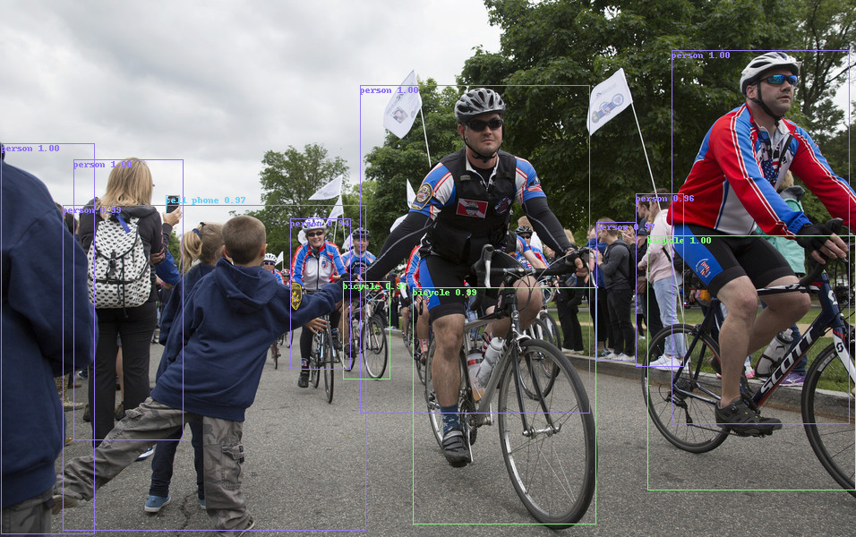

# TorchVision Inference with a Pretrained Model

We will instance a Faster R-CNN pre-trained model in torchvision, and predict the objects for each input image with the model.

```python
import torch
import torchvision
from PIL import Image
```

## Instance a pre-trained model

```python
model = torchvision.models.detection.fasterrcnn_resnet50_fpn(pretrained=True)
```

`print(model)` could see its structure:

```bash
FasterRCNN(
  (transform): GeneralizedRCNNTransform(
      Normalize(mean=[0.485, 0.456, 0.406], std=[0.229, 0.224, 0.225])
      Resize(min_size=(800,), max_size=1333, mode='bilinear')
  )
  (backbone): BackboneWithFPN(
    ...
  )
  (rpn): RegionProposalNetwork(
    (anchor_generator): AnchorGenerator()
    (head): RPNHead(
      (conv): Conv2d(256, 256, kernel_size=(3, 3), stride=(1, 1), padding=(1, 1))
      (cls_logits): Conv2d(256, 3, kernel_size=(1, 1), stride=(1, 1))
      (bbox_pred): Conv2d(256, 12, kernel_size=(1, 1), stride=(1, 1))
    )
  )
  (roi_heads): RoIHeads(
    (box_roi_pool): MultiScaleRoIAlign(featmap_names=['0', '1', '2', '3'], output_size=(7, 7), sampling_ratio=2)
    (box_head): TwoMLPHead(
      (fc6): Linear(in_features=12544, out_features=1024, bias=True)
      (fc7): Linear(in_features=1024, out_features=1024, bias=True)
    )
    (box_predictor): FastRCNNPredictor(
      (cls_score): Linear(in_features=1024, out_features=91, bias=True)
      (bbox_pred): Linear(in_features=1024, out_features=364, bias=True)
    )
  )
)
```

The model return the predictions of the following classes:

```python
COCO_INSTANCE_CATEGORY_NAMES = [
  '__background__', 'person', 'bicycle', 'car', 'motorcycle', 'airplane', 'bus',
  'train', 'truck', 'boat', 'traffic light', 'fire hydrant', 'N/A', 'stop sign',
  'parking meter', 'bench', 'bird', 'cat', 'dog', 'horse', 'sheep', 'cow',
  'elephant', 'bear', 'zebra', 'giraffe', 'N/A', 'backpack', 'umbrella', 'N/A', 'N/A',
  'handbag', 'tie', 'suitcase', 'frisbee', 'skis', 'snowboard', 'sports ball',
  'kite', 'baseball bat', 'baseball glove', 'skateboard', 'surfboard', 'tennis racket',
  'bottle', 'N/A', 'wine glass', 'cup', 'fork', 'knife', 'spoon', 'bowl',
  'banana', 'apple', 'sandwich', 'orange', 'broccoli', 'carrot', 'hot dog', 'pizza',
  'donut', 'cake', 'chair', 'couch', 'potted plant', 'bed', 'N/A', 'dining table',
  'N/A', 'N/A', 'toilet', 'N/A', 'tv', 'laptop', 'mouse', 'remote', 'keyboard', 'cell phone',
  'microwave', 'oven', 'toaster', 'sink', 'refrigerator', 'N/A', 'book',
  'clock', 'vase', 'scissors', 'teddy bear', 'hair drier', 'toothbrush'
]
```

## Specify device for GPU

```python
device = torch.device('cuda') if torch.cuda.is_available() else torch.device('cpu')
```

```python
model.to(device)
```

## Open an input image

```python
img = Image.open('data/bicycle.jpg').convert("RGB")
img = torchvision.transforms.ToTensor()(img)
```

Prepare `images` to be processed by model:

```python
images = [img.to(device)]
```

`data/bicycle.jpg`:


## Inference with the model

```python
# For inference
model.eval()
```

During inference, the model requires only the input tensors, and returns the post-processed
predictions as a ``List[Dict[Tensor]]``, one for each input image. The fields of the ``Dict`` are as
follows:

- boxes (``FloatTensor[N, 4]``): the predicted boxes in ``[x1, y1, x2, y2]`` format, with values of ``x``
  between ``0`` and ``W`` and values of ``y`` between ``0`` and ``H``
- labels (``Int64Tensor[N]``): the predicted labels for each image
- scores (``Tensor[N]``): the scores or each prediction

```python
predictions = model(images)
pred = predictions[0]
print(pred)
```

The prediction for our input image:

```bash
{'boxes': tensor([[750.7896,  56.2632, 948.7942, 473.7791],
        [ 82.7364, 178.6174, 204.1523, 491.9059],
        ...
        [174.9881, 235.7873, 351.1031, 417.4089],
        [631.6036, 278.6971, 664.1542, 353.2548]], device='cuda:0',
       grad_fn=<StackBackward>), 'labels': tensor([ 1,  1,  2,  1,  1,  1,  2,  2,  1, 77,  1,  1,  1,  2,  1,  1,  1,  1,
         1,  1, 27,  1,  1, 44,  1,  1,  1,  1, 27,  1,  1, 32,  1, 44,  1,  1,
        31,  2, 38,  2,  2,  1,  1, 31,  1,  1,  1,  1,  2,  1,  1,  1,  1,  1,
         1,  1,  1,  1,  1,  2,  2,  1,  1,  1,  2,  1,  1,  1,  1,  2,  1,  2,
         1,  1,  1,  1,  1,  1, 31,  2, 27,  1,  2,  1,  1, 31,  2, 77,  2,  1,
         2,  2,  2, 44,  2, 31,  1,  1,  1,  1], device='cuda:0'), 'scores': tensor([0.9990, 0.9976, 0.9962, 0.9958, 0.9952, 0.9936, 0.9865, 0.9746, 0.9694,
        0.9679, 0.9620, 0.9395, 0.8984, 0.8979, 0.8847, 0.8537, 0.8475, 0.7865,
        0.7822, 0.6896, 0.6633, 0.6629, 0.6222, 0.6132, 0.6073, 0.5383, 0.5248,
        0.4891, 0.4881, 0.4595, 0.4335, 0.4273, 0.4089, 0.4074, 0.3679, 0.3357,
        0.3192, 0.3102, 0.2797, 0.2655, 0.2640, 0.2626, 0.2615, 0.2375, 0.2306,
        0.2174, 0.2129, 0.1967, 0.1912, 0.1907, 0.1739, 0.1722, 0.1669, 0.1666,
        0.1596, 0.1586, 0.1473, 0.1456, 0.1408, 0.1374, 0.1373, 0.1329, 0.1291,
        0.1290, 0.1289, 0.1278, 0.1205, 0.1182, 0.1182, 0.1103, 0.1060, 0.1025,
        0.1010, 0.0985, 0.0959, 0.0919, 0.0887, 0.0886, 0.0873, 0.0832, 0.0792,
        0.0778, 0.0764, 0.0693, 0.0686, 0.0679, 0.0671, 0.0668, 0.0636, 0.0635,
        0.0607, 0.0605, 0.0581, 0.0578, 0.0572, 0.0568, 0.0557, 0.0556, 0.0555,
        0.0533], device='cuda:0', grad_fn=<IndexBackward>)}
```

## Plot the result

Get the result only if `score >= 0.9`:

```python
scores = pred['scores']
mask = scores >= 0.9

boxes = pred['boxes'][mask]
labels = pred['labels'][mask]
scores = scores[mask]
```

Import utils to plot the image:

```python
from utils.colors import golden
from utils.plots import plot_image

lb_names = COCO_INSTANCE_CATEGORY_NAMES
lb_colors = golden(len(lb_names), fn=int, scale=0xff, shuffle=True)
lb_infos = [f'{s:.2f}' for s in scores]
plot_image(img, boxes, labels, lb_names, lb_colors, lb_infos,
           save_name='result.png')
```

> Note that ensure `torchvision >= 0.9.0/nightly` if use `utils.plots.plot_image`.



## Sources

- [test_pretrained_models.py](../../tests/test_pretrained_models.py)

`utils.colors.golden`:

```python
import colorsys
import random


def golden(n, h=random.random(), s=0.5, v=0.95,
           fn=None, scale=None, shuffle=False):
  if n <= 0:
    return []

  coef = (1 + 5**0.5) / 2

  colors = []
  for _ in range(n):
    h += coef
    h = h - int(h)
    color = colorsys.hsv_to_rgb(h, s, v)
    if scale is not None:
      color = tuple(scale*v for v in color)
    if fn is not None:
      color = tuple(fn(v) for v in color)
    colors.append(color)

  if shuffle:
    random.shuffle(colors)
  return colors
```

`utils.plots.plot_image`:

```python
from typing import Union, Optional, List, Tuple

import matplotlib.pyplot as plt
import numpy as np
import torch
import torchvision
from PIL import Image


def plot_image(
  image: Union[torch.Tensor, Image.Image, np.ndarray],
  boxes: Optional[torch.Tensor] = None,
  labels: Optional[torch.Tensor] = None,
  lb_names: Optional[List[str]] = None,
  lb_colors: Optional[List[Union[str, Tuple[int, int, int]]]] = None,
  lb_infos: Optional[List[str]] = None,
  save_name: Optional[str] = None,
  show_name: Optional[str] = 'result',
) -> torch.Tensor:
  """
  Draws bounding boxes on given image.
  Args:
    image (Image): `Tensor`, `PIL Image` or `numpy.ndarray`.
    boxes (Optional[Tensor]): `FloatTensor[N, 4]`, the boxes in `[x1, y1, x2, y2]` format.
    labels (Optional[Tensor]): `Int64Tensor[N]`, the class label index for each box.
    lb_names (Optional[List[str]]): All class label names.
    lb_colors (List[Union[str, Tuple[int, int, int]]]): List containing the colors of all class label names.
    lb_infos (Optional[List[str]]): Infos for given labels.
    save_name (Optional[str]): Save image name.
    show_name (Optional[str]): Show window name.
  """
  if not isinstance(image, torch.Tensor):
    image = torchvision.transforms.ToTensor()(image)

  if boxes is not None:
    if image.dtype != torch.uint8:
      image = torchvision.transforms.ConvertImageDtype(torch.uint8)(image)
    draw_labels = None
    draw_colors = None
    if labels is not None:
      draw_labels = [lb_names[i] for i in labels] if lb_names is not None else None
      draw_colors = [lb_colors[i] for i in labels] if lb_colors is not None else None
    if draw_labels and lb_infos:
      draw_labels = [f'{l} {i}' for l, i in zip(draw_labels, lb_infos)]
    # torchvision >= 0.9.0/nightly
    #  https://github.com/pytorch/vision/blob/master/torchvision/utils.py
    res = torchvision.utils.draw_bounding_boxes(image, boxes,
      labels=draw_labels, colors=draw_colors)
  else:
    res = image

  if save_name or show_name:
    res = res.permute(1, 2, 0).contiguous().numpy()
    if save_name:
      Image.fromarray(res).save(save_name)
    if show_name:
      plt.gcf().canvas.set_window_title(show_name)
      plt.imshow(res)
      plt.show()

  return res
```

## References

- [torch.hub](https://pytorch.org/docs/stable/hub.html)
- [torchvision.models](https://pytorch.org/vision/stable/models.html)
