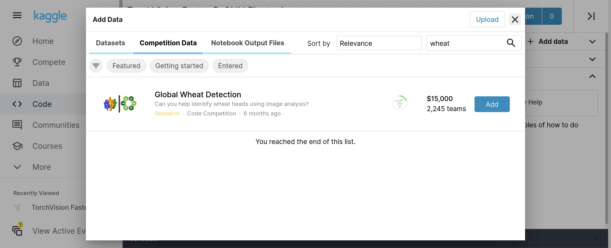
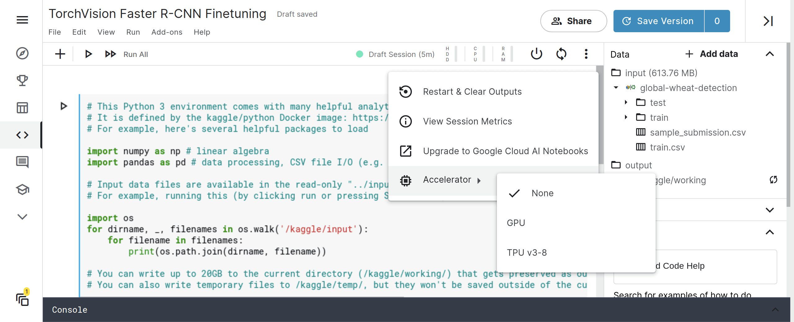

# Use Kaggle Notebooks

Explore and run machine learning code with Kaggle Notebooks. Find help in the [Documentation](https://www.kaggle.com/docs/notebooks).

## New Notebook

See:

## Add Data

See:

## Turn on GPU

