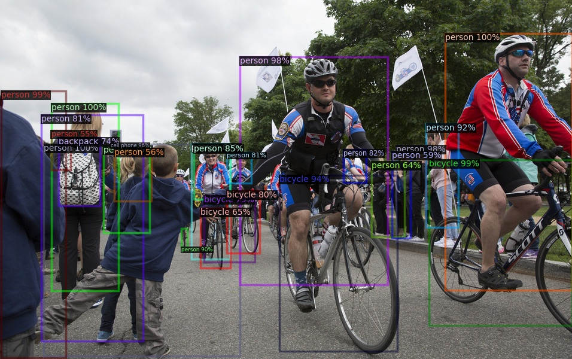
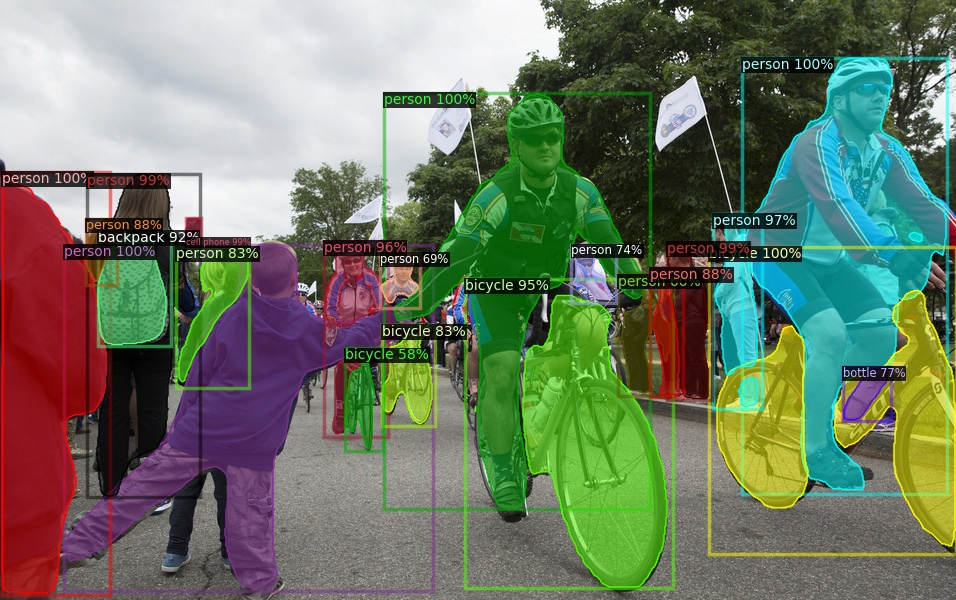
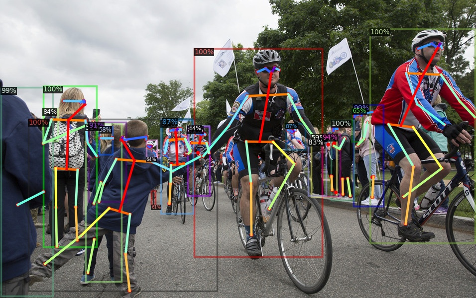
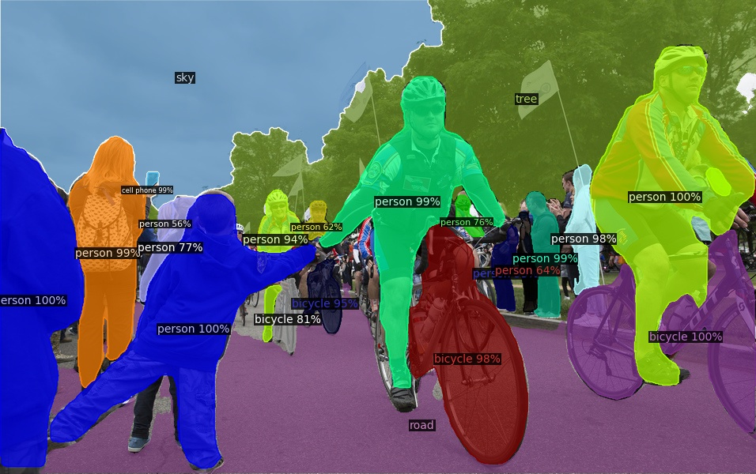

# Inference Demo with Pre-trained Models

```bash
cd detectron2/
mkdir -p output
```

<!--
export PYTHONPATH=$HOME/opencv-4.1.2/lib/python3.7/site-packages:$PYTHONPATH
-->

## COCO Object Detection

Faster R-CNN:

```bash
python demo/demo.py \
  --config-file configs/COCO-Detection/faster_rcnn_R_50_FPN_3x.yaml \
  --input demo/bicycle.jpg --output output/ \
  --opts MODEL.WEIGHTS detectron2://COCO-Detection/faster_rcnn_R_50_FPN_1x/137257794/model_final_b275ba.pkl \
  MODEL.DEVICE cpu
```

```bash
https://dl.fbaipublicfiles.com/detectron2/COCO-Detection/faster_rcnn_R_50_FPN_1x/137257794/model_final_b275ba.pkl

python demo/demo.py \
  --config-file configs/COCO-Detection/faster_rcnn_R_50_FPN_3x.yaml \
  --input demo/bicycle.jpg --output output/bicycle_detection.jpg \
  --opts MODEL.WEIGHTS models/model_final_b275ba.pkl \
  MODEL.DEVICE cpu
```



## COCO Instance Segmentation Baselines with Mask R-CNN

```bash
python demo/demo.py --config-file configs/COCO-InstanceSegmentation/mask_rcnn_R_50_FPN_3x.yaml \
  --input demo/bicycle.jpg --output output/ \
  --opts MODEL.WEIGHTS detectron2://COCO-InstanceSegmentation/mask_rcnn_R_50_FPN_3x/137849600/model_final_f10217.pkl \
  MODEL.DEVICE cpu
```

```bash
https://dl.fbaipublicfiles.com/detectron2/COCO-InstanceSegmentation/mask_rcnn_R_50_FPN_3x/137849600/model_final_f10217.pkl

python demo/demo.py --config-file configs/COCO-InstanceSegmentation/mask_rcnn_R_50_FPN_3x.yaml \
  --input demo/bicycle.jpg --output output/bicycle_instance_segmentation.jpg \
  --opts MODEL.WEIGHTS models/model_final_f10217.pkl \
  MODEL.DEVICE cpu
```



## COCO Person Keypoint Detection Baselines with Keypoint R-CNN

```bash
python demo/demo.py --config-file configs/COCO-Keypoints/keypoint_rcnn_R_50_FPN_3x.yaml \
  --input demo/bicycle.jpg --output output/ \
  --opts MODEL.WEIGHTS detectron2://COCO-Keypoints/keypoint_rcnn_R_50_FPN_3x/137849621/model_final_a6e10b.pkl \
  MODEL.DEVICE cpu
```

```bash
https://dl.fbaipublicfiles.com/detectron2/COCO-Keypoints/keypoint_rcnn_R_50_FPN_3x/137849621/model_final_a6e10b.pkl

python demo/demo.py --config-file configs/COCO-Keypoints/keypoint_rcnn_R_50_FPN_3x.yaml \
  --input demo/bicycle.jpg --output output/bicycle_keypoints.jpg \
  --opts MODEL.WEIGHTS models/model_final_a6e10b.pkl \
  MODEL.DEVICE cpu
```



## COCO Panoptic Segmentation Baselines with Panoptic FPN

```bash
python demo/demo.py --config-file configs/COCO-PanopticSegmentation/panoptic_fpn_R_101_3x.yaml \
  --input demo/bicycle.jpg --output output/ \
  --opts MODEL.WEIGHTS detectron2://COCO-PanopticSegmentation/panoptic_fpn_R_101_3x/139514519/model_final_cafdb1.pkl \
  MODEL.DEVICE cpu
```

```bash
https://dl.fbaipublicfiles.com/detectron2/COCO-PanopticSegmentation/panoptic_fpn_R_101_3x/139514519/model_final_cafdb1.pkl

python demo/demo.py --config-file configs/COCO-PanopticSegmentation/panoptic_fpn_R_101_3x.yaml \
  --input demo/bicycle.jpg --output output/bicycle_panoptic_segmentation.jpg \
  --opts MODEL.WEIGHTS models/model_final_cafdb1.pkl \
  MODEL.DEVICE cpu
```


